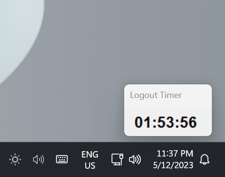

# AutoLogout

> **Install this utility on a Windows profile to create a simple, time-limited session.**

A timer appears on the bottom right of the Desktop, and a sound will play when 10 minutes remain. If the time limit ends after bed time, it is shortened. The time limit can be infinite, and the wake and sleep times can be disabled.

The time limit resets each day. If a user logs out, the timer will resume when they log back in.

There is a password-protected parental dashboard to control the time given each day or easily tweak settings at any time.

## Limitations

- The time-restricted accounts shouldn't be Administrator accounts.
- The entire program runs within userspace, meaning it is possible for a technical user to find and kill the process, or prevent it from starting automatically.
  - You can protect files using permissions in Windows, however.
- While the timer is paused, the computer will not shut down past bedtime.
- The pause feature is not intended for multiple monitor setups.

## Instalation

Download the latest zip file in [releases](releases) and follow the instructions from there.
