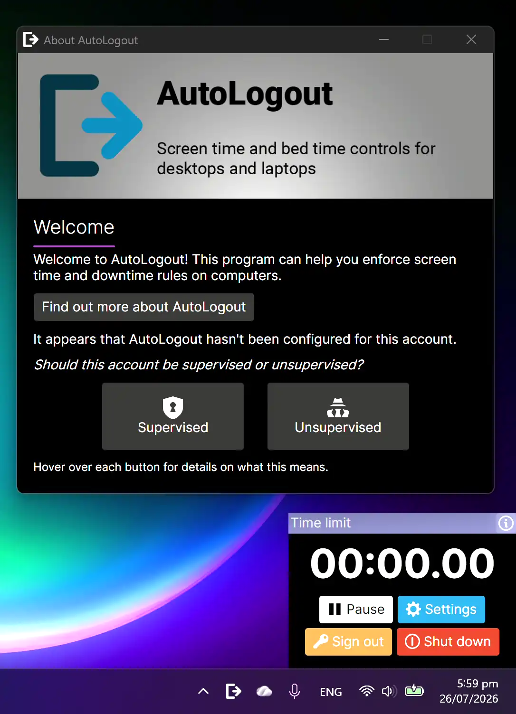
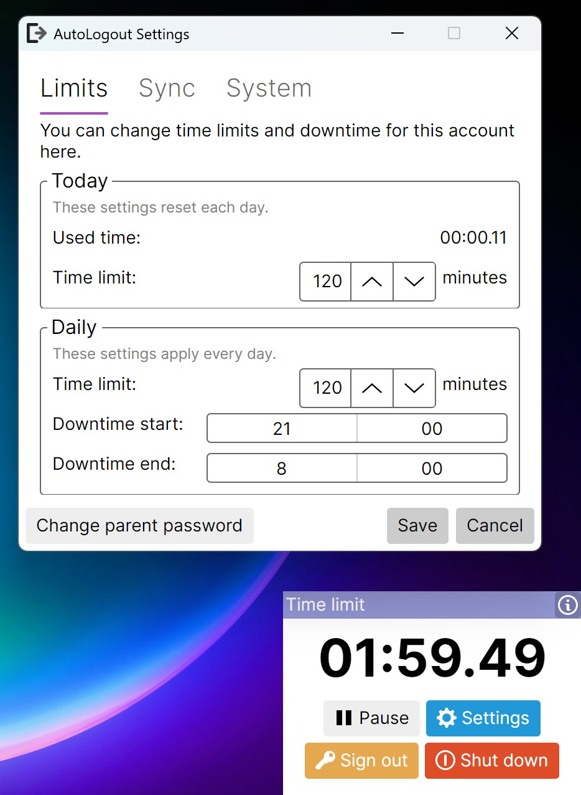
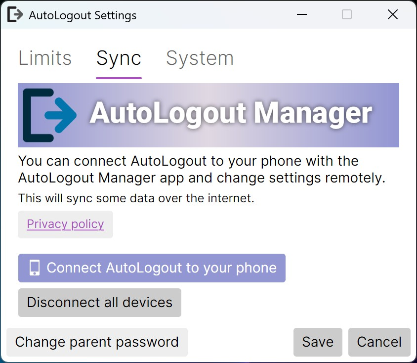

# AutoLogout



> **Install this utility on a Windows profile to create a simple, time-limited session.**

A timer appears on the bottom right of the Desktop, and a sound will play when 10 minutes remain. If the time limit ends after bed time, it is shortened. The time limit can be infinite, and the wake and sleep times can be disabled.

The time limit resets each day. If a user logs out, the timer will resume when they log back in.

## ControlPanel



There is a password-protected parental dashboard to control the time given each day or easily tweak settings at any time.

## AutoLogout Manager



Usage and limits can be monitored remotely with the [AutoLogout Manager app](https://autologout.yiays.com/app). *All user data stays completely offline if you choose not to set up AutoLogout Manager.*

## Limitations

- The time-restricted accounts shouldn't be Administrator accounts.
- The entire program runs within userspace, meaning it is possible for a technical user to find and kill the process.
- While the timer is paused, the computer will not shut down past bedtime.
- The pause feature is not intended for multiple monitor setups.

## Instalation

### Windows

AutoLogout is on **winget**! You can install with the following command;
```
winget install Yiays.AutoLogout
```

Alternatively, download the latest installer in [releases](https://github.com/yiays/AutoLogout/releases) and follow the instructions from there.

### Mac OS

*Coming soon...*

### Linux

*Coming soon...*