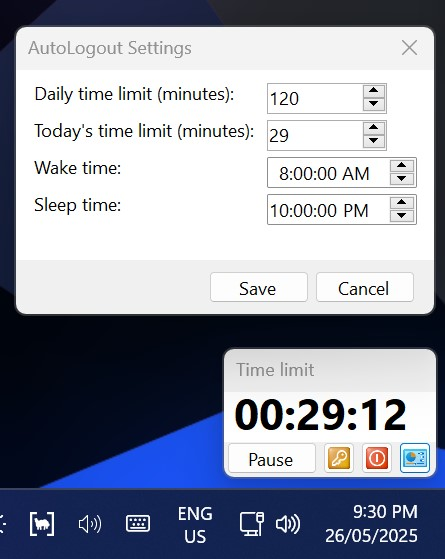

# AutoLogout

Install this utility on a Windows profile to create a simple, time-limited session.

A parent or supervisor enters the time limit after the user logs in. A timer appears on the bottom right of the Desktop, and a sound will play when 10 minutes remain.

## Limitations

- This version is intended for users that aren't able to log in without supervision. For example, if they aren't given the password for their account.
- The entire program runs within userspace, meaning it is possible for a technical user to find and kill the process, or prevent it from starting.
- The user can close the timer window through a variety of methods.
  - The process that logs the user out is independant of the timer window, so users will still be logged out on time if the timer is closed.
- The user could mute the 10 minute warning sound, rendering the warning ineffective.
- Sleeping the computer pauses the timer.
- Untested behaviour if the account is locked or switched when the timer runs out.

## Instalation

Create a shortcut to RunHidden in this folder, then edit the shortcut to add `<space>logoutTimer.ps1` at the end of the Target.

Move this shortcut to "Startup apps for profile" to make it automatically start up when the user logs in.